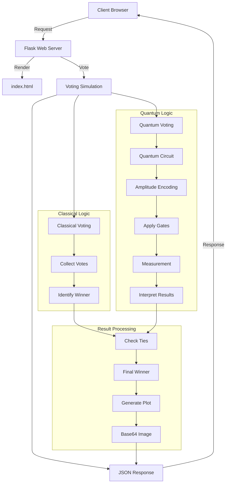

# <div align="center"> Q-Ballot 🗳️ 
<i> </div> <p align="center"> A quantum voting system utilizing quantum superposition and entanglement for secure and private voting </i></b> </p>
<i> </div> <p align="center"> Made by Ayushi Arora, Kirti Gupta, Drishti Rani & Mimansa Tripathi </i></b> </p>


## </div> <p align="center"> <b>Quantum Voting meets Blockchain!</b> </p>
## <p align="left">🚀 Project Overview</p>
Q-Ballot is a quantum-enhanced, privacy-preserving, and tamper-resistant digital voting platform designed to address critical limitations of traditional and blockchain-based e-voting systems. Built on the principles of quantum key distribution (QKD) and post-quantum cryptography (PQC), Q-Ballot ensures long-term voter privacy, vote integrity, and resistance to quantum attacks.
It proposes an end-to-end verifiable voting ecosystem with enhanced trust and transparency. Voters are authenticated using post-quantum credentials. Their ballots are encrypted using quantum-safe algorithms and shuffled anonymously via secure MPC protocols. After verification via ZKPs, encrypted ballots are posted to a tamper-proof blockchain for transparent tallying.
This novel system bridges the gap between secure electronic voting and long-term quantum resilience.

## <p align="left"> Demo Video </p>


https://github.com/user-attachments/assets/8bfb1345-a8bc-4b20-b323-38527fd21883


## <p align="left"> 🏗️ Architecture </p>



## <p align="left">✨ Features</p>

- 🧑‍🔬 Quantum Voting using Qiskit
- 🗳️ Multiple Voters Simulation
- 📊 Voting Results Visualization with histograms
- 🛠️ Planned Improvements:
    - Blockchain integration for vote immutability
    - User-friendly web interface for voting
More voting options and candidate choices.

## 💡 Novelty & Research Contribution
- First integration of quantum key distribution (QKD) and post-quantum cryptography (PQC) in a verifiable voting pipeline.
- Provides long-term resistance against quantum adversaries unlike traditional systems or even current blockchain-based models.
- Introduces hybrid quantum-classical design, combining quantum-safe authentication, vote anonymization, and blockchain immutability.
- Emphasizes transparency and individual verifiability using zero-knowledge proofs, which are post-quantum secure.
- Scalability and auditability are enhanced via zk-rollups and Merkle-tree-based tracking.
  
## <p align="left"> Proposed Soultion in Detail</p>
🔐 **Quantum-Secure Authentication**
- Voter identity is verified using quantum-safe cryptographic techniques (e.g., lattice-based or hash-based digital signatures).
- Integration of quantum key distribution to ensure that credentials and ballots remain confidential, even against future quantum adversaries.

 🗳️ **Privacy-Preserving Voting**
- Ballot encryption using quantum-resistant algorithms (e.g., Kyber).
- Votes are anonymized and randomized before submission using quantum-secure shuffle or homomorphic encryption.
- Ensures voter privacy even from the system operator.

🔄** Verifiable Vote Integrity**
- Post-quantum zero-knowledge proofs (ZKPs) enable vote integrity and correctness without revealing vote contents.
- End-to-end verifiability: voters can independently verify that their vote was cast, recorded, and tallied correctly.

 🌐** Decentralized Architecture**
- Built using smart contracts deployed on a secure blockchain (e.g., Algorand or Ethereum with zk-rollups).
- Distributed ledger provides immutability and transparency.

📊 **Real-Time Tallying & Auditability**
- Votes can be tallied in real-time using homomorphic tallying techniques.
- Audit trails generated using Merkle trees and cryptographic proofs.


## 🚀 Proposed Solution
Q-Ballot proposes an end-to-end verifiable voting ecosystem with enhanced trust and transparency. Voters are authenticated using post-quantum credentials. Their ballots are encrypted using quantum-safe algorithms and shuffled anonymously via secure MPC protocols. After verification via ZKPs, encrypted ballots are posted to a tamper-proof blockchain for transparent tallying.

This novel system bridges the gap between secure electronic voting and long-term quantum resilience.

## 📎 Future Enhancements
- Integration with real-world QKD networks.
- Quantum Random Number Generators (QRNGs) for true unpredictability in vote shuffling.
- Support for multi-district elections with distributed voting authorities.
- Simulation of quantum attacks to test system robustness.


## <p align="left">⚙️ Tech Stack</p>
<div align="left">
<a href="https://qiskit.org/"></a> <a href="https://www.python.org/"></a> <a href="https://flask.palletsprojects.com/"></a> <a href="https://www.javascript.com/"></a> <a href="https://nodejs.org/en/"></a>

##  <p align="left">📋 Requirements</p>
To run Q-Vote, ensure you have the following installed:

- 🐍 Python 3.x
- 💻 Qiskit (install via pip)
## <p align="left">📦 Installation</p>
### <p align="left">Locally</p>
1. Clone this repository:

```bash
git clone https://github.com/vigneshs-dev/Q-Vote.git
```
2. Navigate into the project directory:

```bash
cd Q-Vote
```
3. Create a virtual environment:

- On Windows:

```bash
python -m venv venv
```

- On macOS/Linux:

```bash
python3 -m venv venv
```
4. Activate the virtual environment:

- On Windows:

```bash
.\venv\Scripts\activate
```
- On macOS/Linux:

```bash
source venv/bin/activate
```
5. Install the required dependencies:

```bash
pip install -r src/requirements.txt
```
6. Run the quantum voting simulation:

```bash
python .\src\app.py
```
The output will start Flask Server which will run on http://127.0.0.1:5000

### <p align="left">Docker</p>
```bash
git clone https://github.com/vigneshs-dev/Q-Vote.git
```
2. Navigate into the project directory:

```bash
cd Q-Vote
```

3. Build the docker image:
```bash
docker build -t qvote .
```

4. Run the in a docker container:
```bash
docker run -p 5000:5000 qvote
```

## <p align="left">🛠 Contributing</p>
We welcome contributions! Here's how you can contribute:

- [ ] 🔗 Implement blockchain integration for immutability.
- [ ] 🌐 Develop a web interface for a better voting experience.
- [ ] 🔄 Optimize quantum circuits for efficiency.
- [ ] ✍️ Write unit tests for code reliability.

<!-- ### Steps to Contribute:
1. Fork the repository.

2. Create an issue for new features or bug fixes:

    - Go to the Issues section of the repository.
    - Create a new issue, providing a detailed description of the feature or bug.
    - Ask to be assigned to that issue by commenting on it.
    - Wait for confirmation or assignment of the issue before proceeding.
    - Sync your fork with the upstream repository to ensure you're working with the latest code:

```bash
git remote add upstream https://github.com/ORIGINAL_OWNER/REPOSITORY_NAME.git
git fetch upstream
git checkout main
git merge upstream/main
```
3. Create a new branch for your feature or fix:

```bash
git checkout -b feature-name
```
4. Make your changes and commit them:

```bash
git commit -m "Add some feature"
```
5. Push your branch to your fork:

```bash
git push origin feature-name
```
6. Create a Pull Request (PR):

- Go to your fork on GitHub.
- Click on the Compare & Pull Request button.
- In the PR description, reference the issue you're addressing using the format Closes #ISSUE_NUMBER.
- Ensure the maintainers review your PR and provide any necessary feedback.
 -->


